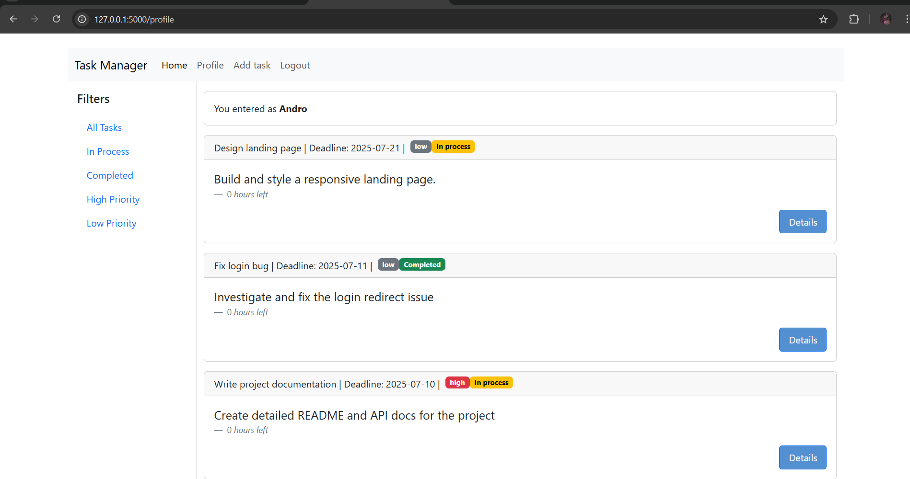
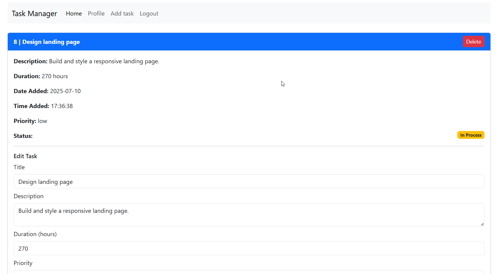
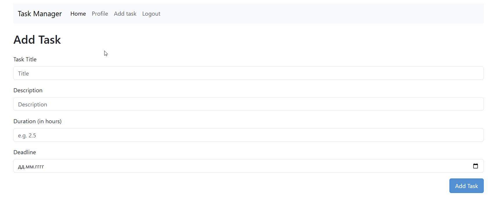

# Task Manager

Task Manager is a web application for efficient task organization and tracking.  
It allows users to create, edit, and delete tasks, assign priorities, set deadlines, and filter tasks by various parameters.  
With a clean interface and responsive design, it provides a convenient way to manage personal or team projects.

---

## 🚀 Features
- **User Authentication** — registration, login, and logout system.
- **Task Creation** — add tasks with description, duration, and deadline.
- **Prioritization** — set task priority (`Low`, `High`).
- **Status Tracking** — mark tasks as `In Process` or `Completed`.
- **Editing & Deleting** — update or remove existing tasks.
- **Filtering** — view tasks by status or priority.
- **Responsive Design** — optimized for desktop and mobile with Bootstrap.

---

## 🛠️ Technologies Used
- **Backend:** Python, Flask  
- **Database:** PostgreSQL  
- **Frontend:** HTML, CSS, Bootstrap  
- **Libraries:** psycopg2, Werkzeug  

---

## 📦 Installation

<ol>
  <li>(Optional) Create a Python virtual environment:
  <code>python -m venv venv</code></li>
  <li>Activate the virtual environment:
    <ul>
      <li>Windows: <code>venv\Scripts\activate</code></li>
      <li>Linux/Mac: <code>source venv/bin/activate</code></li>
    </ul>
  </li>
  <li>Install the required libraries:
    <ol>
      <li><code>pip install flask</code></li>
      <li><code>pip install psycopg2</code></li>
      <li><code>pip install werkzeug</code></li>
      <li>Create and connect to a PostgreSQL database</li>
    </ol>
  </li>
  <li>Run the Flask local server:
    <code>python app.py</code>
  </li>
</ol>

---

## 📷 Demonstration

**Profile Page**

**Task Details**

**Add Task**

